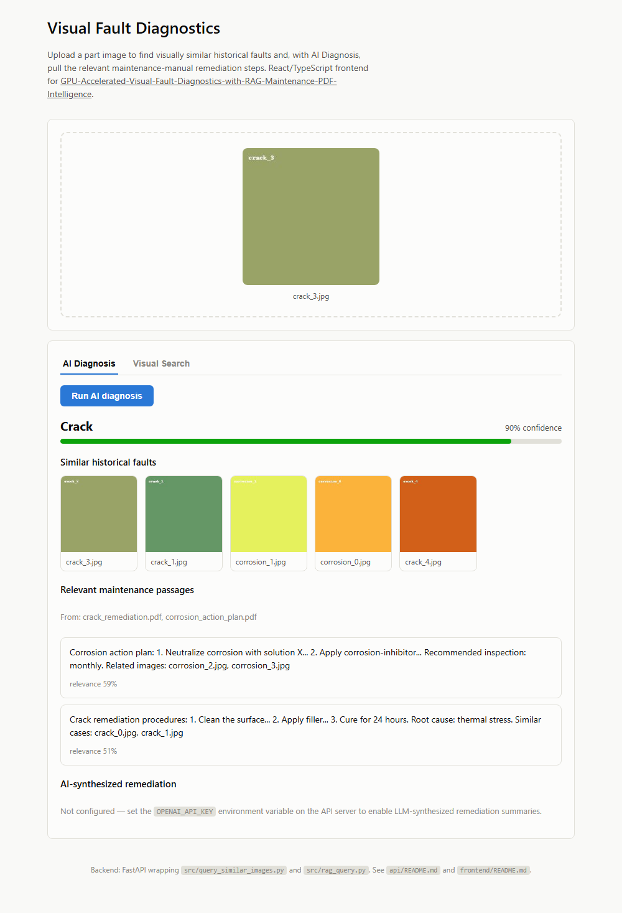
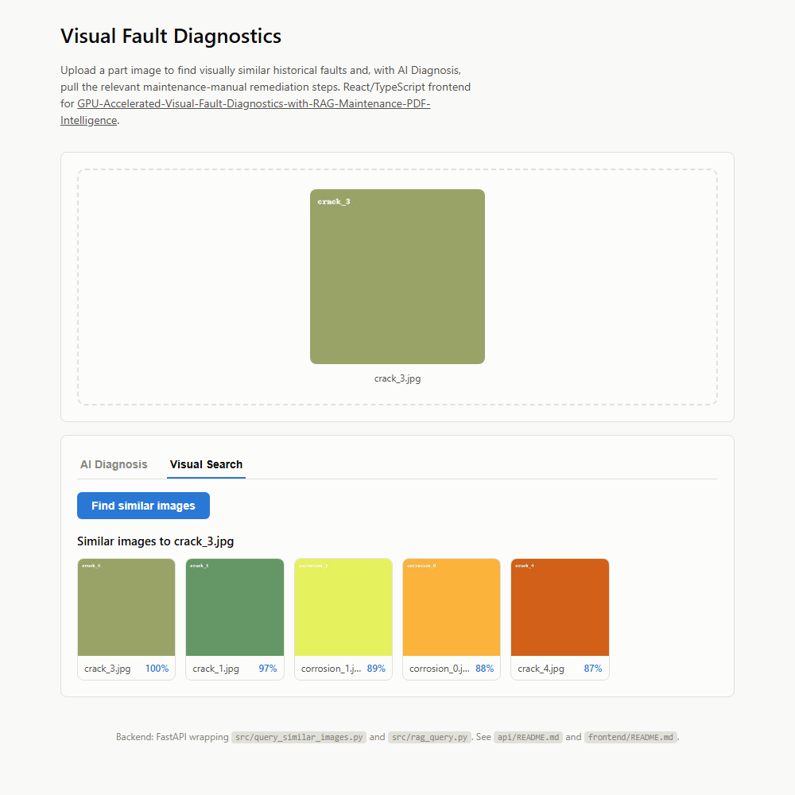
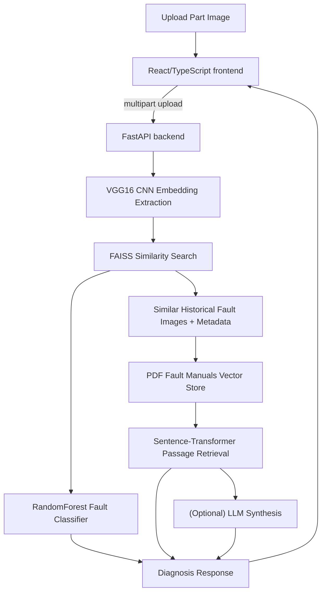

# Enterprise GPU-Accelerated Visual Fault Diagnostics with RAG & Maintenance PDF Intelligence <sub>(Vision AI + FAISS-GPU + LLM PDF Knowledge Retrieval for Industrial Defect Root-Cause Analysis)</sub>

## Overview

This system implements an **end-to-end intelligent fault analysis pipeline** for enterprise and industrial manufacturing environments:

| Layer | Capability |
|---|---|
| Vision | VGG16 / TF-GPU image fault classifier |
| Search | FAISS-GPU similarity search for historical defective parts |
| Knowledge | PDF maintenance instructions + RAG for intelligent troubleshooting |
| AI Assistant | LLM answers using enterprise fault documentation |
| API | FastAPI REST backend for the vision + RAG pipeline |
| UI | React/TypeScript diagnostics app, and a Streamlit visual-search app |
| Equipped for | NVIDIA GPUs, CUDA, enterprise workloads |

Designed for digital factories, predictive maintenance teams, and AI-augmented manufacturing support systems.

---

## Screenshots

The [React/TypeScript frontend](frontend/README.md)'s **AI Diagnosis** tab — classifier
prediction with a confidence meter, visually similar historical faults, and
retrieved maintenance-manual passages, all from one uploaded image:



The **Visual Search** tab — pure image-similarity retrieval, no classifier
or RAG involved, with a similarity score per result:



---

## Key Features

- **GPU-accelerated training & inference** (TensorFlow-GPU, FAISS-GPU)
- **Image fault classification + similar-image retrieval**
- **PDF fault manual ingestion** → **vector store**
- **LLM-powered fault explanation & root-cause reasoning**
- **FastAPI REST backend** in front of the vision + RAG pipeline
- **React/TypeScript frontend** for interactive diagnosis
- **Production-style modular codebase**

---

## High-Level Architecture



**(Optional) Set the `OPENAI_API_KEY` environment variable on the API server** to enable LLM synthesis of summarized remediation steps. Without it, `/api/diagnose` still returns the classifier prediction, similar historical images, and retrieved maintenance passages — just without the LLM-written summary paragraph.

### Repository structure

```
.
├── api/                        # FastAPI backend (see api/README.md)
│   ├── main.py                 #   /api/health, /api/search, /api/diagnose
│   ├── models.py                #   loads + caches VGG16/FAISS/sentence-transformer once at startup
│   └── schemas.py               #   Pydantic response models
├── frontend/                   # React + TypeScript app (see frontend/README.md)
│   └── src/
├── app/
│   └── streamlit_visual_search.py   # original Streamlit visual-search UI (still works)
├── src/
│   ├── config.py
│   ├── extract_embeddings.py    # image_dir -> VGG16 embeddings.npy + image_names.npy
│   ├── build_faiss_index.py     # embeddings.npy -> index.faiss
│   ├── ingest_pdfs.py           # data/docs/*.pdf -> faiss_text_index.faiss + passages
│   ├── train_classifier.py      # embeddings.npy + labels.csv -> classifier.joblib
│   ├── query_similar_images.py  # CLI: find similar images for a query image
│   └── rag_query.py             # CLI + library: image -> labels -> docs -> passages -> (optional) LLM
├── data/
│   ├── raw/                    # sample fault images
│   ├── docs/                   # sample maintenance PDFs
│   ├── processed/              # labels.csv, doc_map.csv
│   └── faiss_index/            # generated by the Quickstart below -- gitignored
├── notebooks/                   # exploratory notebooks
├── requirements.txt              # CPU-friendly by default
├── requirements-gpu.txt          # optional GPU acceleration (faiss-gpu, cuDNN)
└── Dockerfile.gpu                # example CUDA-enabled container
```

---

## Quickstart

### 1. Install Python dependencies

```bash
python -m venv .venv
source .venv/bin/activate   # Windows: .venv\Scripts\activate
pip install -r requirements.txt
```

This installs a CPU build of TensorFlow and FAISS, so the whole pipeline
runs without a GPU. For GPU acceleration, see [GPU setup](#gpu-setup) below.

### 2. Build the embeddings, image index, text index, and classifier

Run these **in order** — each one depends on the previous step's output:

```bash
python -m src.extract_embeddings   # data/raw/*.jpg -> embeddings.npy, image_names.npy
python -m src.build_faiss_index    # embeddings.npy -> index.faiss
python -m src.ingest_pdfs          # data/docs/*.pdf -> faiss_text_index.faiss + passages
python -m src.train_classifier     # embeddings.npy + labels.csv -> classifier.joblib
```

(Run as `python -m src.<name>`, not `python src/<name>.py` — the scripts
import sibling modules as `src.config` etc., which only resolves correctly
when Python is invoked as a module from the repo root.)

### 3. Run it

**Option A — REST API + React/TypeScript frontend (recommended):**

```bash
# Terminal 1
uvicorn api.main:app --reload --port 8000

# Terminal 2
cd frontend
npm install
npm run dev
```

Open the URL Vite prints (typically http://localhost:5173). Upload a fault
image from `data/raw/` and either run **Visual Search** (find similar
historical faults) or **AI Diagnosis** (classifier prediction + similar
faults + retrieved remediation passages + optional LLM synthesis). See
[`api/README.md`](api/README.md) and [`frontend/README.md`](frontend/README.md)
for endpoint details and configuration.

**Option B — original Streamlit visual-search app:**

```bash
streamlit run app/streamlit_visual_search.py
```

### GPU setup

```bash
sudo apt install nvidia-driver-530 nvidia-cuda-toolkit
pip install -r requirements.txt
pip uninstall faiss-cpu
pip install -r requirements-gpu.txt
```

`faiss-cpu` and `faiss-gpu` both install the same `faiss` module, so install
the GPU one *instead of*, not alongside, the CPU one. See
[`Dockerfile.gpu`](Dockerfile.gpu) for a full containerized CUDA environment.

---

## Enterprise Use-Cases

| Industry | Use Case |
|----------|----------|
| Automotive | Visual quality inspection + service manual lookups |
| Aerospace | Turbine/airframe defect search + maintenance docs QA |
| Semiconductor | Wafer anomaly classification + tool maintenance PDFs |
| Oil & Gas | Pipeline corrosion recognition + repair SOP linking |
| OEM & Factory QA | AI visual assistant for line-side technicians |

---

## Enterprise-Ready Capabilities

| Capability | Description |
|------------|-------------|
| RAG w/ PDF manuals | Knowledge-augmented troubleshooting |
| GPU inference | Real-time similarity search + CNN embeddings |
| Air-gapped support | No cloud dependency required |
| Scalable | Modular services for MLOps pipelines |
| Extensible | Swap VGG16 → ViT / YOLO / EfficientNet |

---

## Roadmap

| Feature | Status |
|---------|--------|
| CNN Fault Classifier | Done |
| FAISS-GPU Similarity Search | Done |
| PDF Fault Ingest + Embeddings | Done |
| RAG Query System | Done |
| REST API / FastAPI microservice | Done |
| React/TypeScript frontend | Done |
| Helm + EKS GPU deployment | Planned |
| YOLO defect localization | Planned |

---

## Summary

This repository demonstrates a real-world enterprise AI system combining:

- Computer vision defect detection
- GPU-accelerated similarity search
- PDF maintenance manual intelligence
- RAG + LLM technician assistant
- A FastAPI backend and React/TypeScript frontend for interactive use

<ins>Perfect for</ins>:

- Manufacturing AI innovation teams
- Maintenance automation & smart factory projects
- Industrial ML upskilling & PoC deployments

---

Thank you for reading

---

### **AUTHOR'S BACKGROUND**

### Author's Name:  Emmanuel Oyekanlu
```
Skillset:   I have experience spanning several years in data science, software and AI solution design and deployments, data engineering,
high performance computing (GPU, CUDA), machine learning, MLOps, NLP, Agentic-AI and LLM applications, developing scalable enterprise data pipelines,
enterprise solution architecture, architecting enterprise systems data and AI applications, as well as deploying scalable solutions (apps) on-prem and in the cloud.

I can be reached through: manuelbomi@yahoo.com

Website:  http://emmanueloyekanlu.com/
Publications:  https://scholar.google.com/citations?user=S-jTMfkAAAAJ&hl=en
LinkedIn:  https://www.linkedin.com/in/emmanuel-oyekanlu-6ba98616
Github:  https://github.com/manuelbomi

```
[](https://skillicons.dev)
